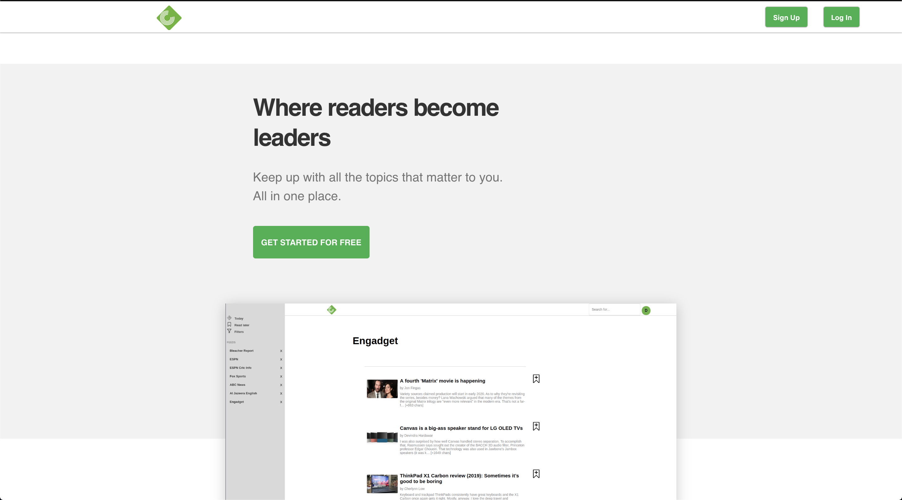
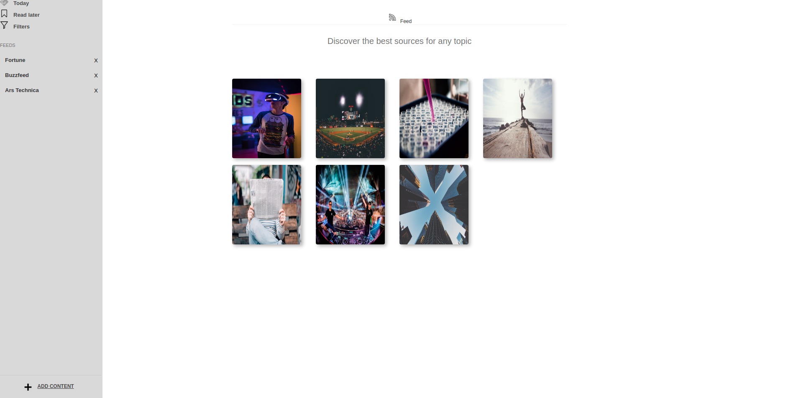
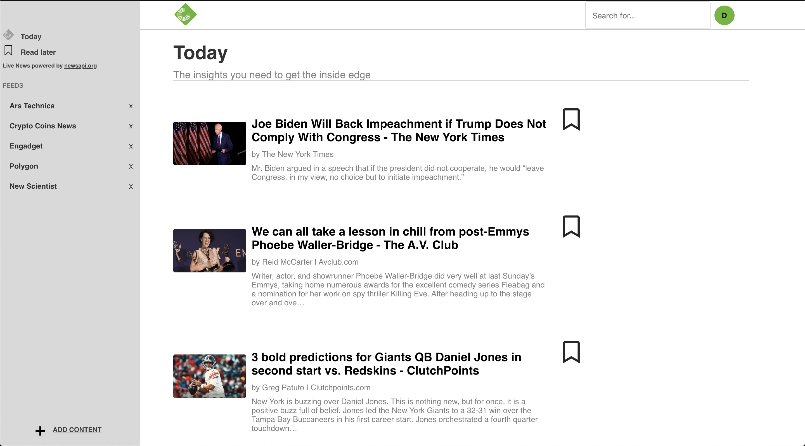
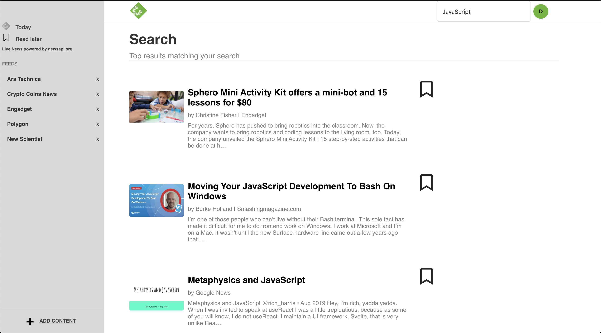

# Compleetly

Interest based news feed - live updating with top trending articles
Users can select articles to read later and they can search for articles as well as have follows

https://compleetly.herokuapp.com/#/

# Technologies
- JavaScript
- React
- Node.js
- Axios
- Mongoose
- Docker
- MongoDB
- Heroku Container Registry




# Features
    * New account creation, login, and guest login
    * Ability to follow news source
    * Ability to browse a discover popular sources and articles
    * Can select articles to read later
    * Today - top trending articles from today can be browsed and marked to read later
    * Search - articles can be searched and you can select articles to read later

# Project Design

Compleetly was designed and built in 1 week and 2 days. 

A proposal was drafter with a schema, sample state, and backend/frontend routes to guide/outline the process

# Implementation

Passwords are secured using BCrypt to generate a passord_digest. A user session_token is stored in the database to keep track of each user session. When a user successfully logs in, a session token is generated, stored in the database, and stored on the client-side as a browser cookie.

### Follows/Add Content



Users has the ability follow news sources that are live updated with the top trending news. A user(once signed in) can follow sources and then later choose articles from just that source the users follows will appear in their user nav bar once logged in to the left of the screen.

```
if (!!followName.includes(article.name)) {
    return <li key={i} className='articles-li'>
        <button className='unfollow-btn' 
            onClick={() => deleteFollow({ 
                followId: article.followId, 
                currentUserId: currentUserId 
            })}>
                <span>FOLLOWING</span>
        </button>
        <a target='_blank' rel="noopener noreferrer" href={article.url} className='a-tag'>
            <h2 className='articles-li-title'>{article.name}</h2>
            <p className='articles-li-url'>{article.url}</p>
            <p className='articles-li-description'>{article.description}</p>
        </a>
    </li>
} else {
    return <li key={i} className='articles-li'>
        <button className='articles-li-btn' 
            onClick={() => createFollow({ 
                source: article.id, 
                followName: article.name, 
                followURL: article.url, 
                currentUserId: currentUserId
                })}>
                FOLLOW
        </button>
        <a target='_blank' rel="noopener noreferrer" href={article.url} className='a-tag'>
            <h2 className='articles-li-title'>{article.name}</h2>
            <p className='articles-li-url'>{article.url}</p>
            <p className='articles-li-description'>{article.description}</p>
        </a>
    </li>
}
```

### Read Later


Users can add articles to their read later section. A user can add articles from a search, from Today's top trending articles or from any of the articles in one of the followed sources categories

```
let readLaterButton;
      readLaterButton =
        !this.isIncluded() ? (
          <button
            onClick={() =>
              this.props.createReadLater({
                readLaterURL: article.url,
                readLaterName: article.source.name,
                readLaterDescription: article.description,
                reader: this.props.user.id
              })
            }
            className="source-read-later-button"
          >
            <i className="far fa-bookmark add-source-read-later-icon"></i>
          </button>
        ) : (
          <button
            onClick={() =>
              this.props.deleteReadLater({
                reader: this.props.user.id,
                readLaterId: this.readLater._id
              })
            }
            className="delete-source-read-later-button"
          >
            <i className="fas fa-bookmark delete-source-read-later-icon"></i>
          </button>
        );
```

### Today Page



Today page is a list of all of the top trending news articles right now. The user can select the articles to view the entire articles in a new tab on their browser, or the user can select read later to put it in their read later section to view the article/articles at a later date

```
    componentDidMount() {
        this.getArticles();
    }
    
    getArticles() {
        const url = 'https://newsapi.org/v2/top-headlines?' +
        'country=us&' +
        'apiKey=e7cee6371dc3402f80bc03f623f8c410';
        const req = new Request(url);
        axios(req).then(res => {
            this.setState({articles: res.data.articles})
        })
    }
```

### Search



A user can search for the articles that they want to read. They can select articles from the search results to read later, or just open them up in a new tab to view later
```
  getInfo = e => {
    e.preventDefault();
    const url =
      "https://newsapi.org/v2/everything?" +
      "language=en&" +
      `q=${this.state.query}&` +
      "apiKey=e7cee6371dc3402f80bc03f623f8c410";
    const req = new Request(url);
    // debugger;
    axios(req).then(({ data }) => {
      this.props.history.push({
        pathname: `/searchresults/${this.state.query}`,
        state: { articles: data.articles }
      });
    });
  };

  update = e => {
    this.setState({
      query: this.search.value,
      articles: []
    });
  };
```

### Docker

Deployed the Docker image of the app on Heroku for instant replicability between devices 

```
FROM node:11-alpine
WORKDIR /usr/src/app
ARG NODE_ENV=production
ENV PATH /usr/src/app/node_modules/.bin:$PATH
COPY . /usr/src/app
RUN npm install --silent 
RUN npm run heroku-postbuild
CMD ["npm", "start"]
```
### Coming Features

There were a couple of features we wanted to implement that we didn't get the chance to, they are as follows.

    * Favorites
